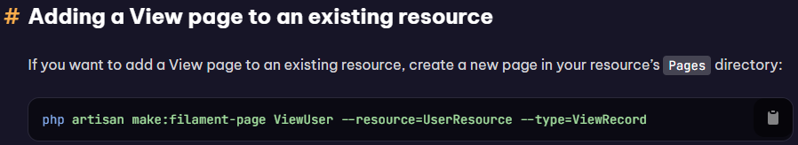

1. Filament Installation : 

Laravel 10.3 => composer create-project laravel/laravel="10.3.*" (nama Project)
Migration terlebih dahulu => php artisan migrate
Filament 3 => composer require filament/filament:"^3.3" -W
Install Panel Filament => php artisan filament:install --panels
Create user pertama => php artisan make:filament-user

2. Simple Resource : 

membuat Resource tanpa relasi => php artisan make:filament-resource (nama Resource) --simple
membuat Resource Default menggunakan relasi => php artisan make:filament-resource (nama Resource)

3. Resource

Melink kan storage : php artisan storage:link

mengganti App_URL di dalam .env => APP_URL=http://localhost:8000 / http://127.0.0.1:8000 

4. Translation

Membuat Kolom Index didalam list : 
TextColumn::make('index')->state(
    static function (HasTable $livewire, stdClass $rowLoop): string {
        return (string) (
            $rowLoop->iteration +
            ($livewire->getTableRecordsPerPage() * (
                $livewire->getTablePage() - 1
            ))
        );
    }
)

dengan Class => use Filament\Tables\Contracts\HasTable;

Membuat Translation (Error) : 
php artisan vendor:publish --tag=filament-panels-translations
merubah di app.php => 'locale' => 'id', mengganti nama Dashboard berada di lang id nya

5. Relation Manager
Menggunakan resource baru yaitu filament-resource-relation :

"php artisan make:filament-relation-manager CategoryResource posts title"

CategoryResource is the name of the resource class for the owner (parent) model.
posts is the name of the relationship you want to manage.
title is the name of the attribute that will be used to identify posts.

dan jangan lupa untuk membuat / memanggil formnya di dalam File Main Resource 

6 Theme (Tema)
Memasukkan Create Custom  Theme : php artisan make:filament-theme

Pemberitahuan : 
 WARN  Action is required to complete the theme setup:  

  ⇂ First, add a new item to the `input` array of `vite.config.js`: `resources/css/filament/admin/theme.css`  
  ⇂ Next, register the theme in the admin panel provider using `->viteTheme('resources/css/filament/admin/theme.css')`
  ⇂ Finally, run `npm run build` to compile the theme

Jika Sudah Masuk kedalam Resource->css->filament->theme.css, klik import pertama, klik index.css

7 Create Option Form

menambahkan fitur tambah didalam Resource yang ada Relationship / Relationship Resource, dengan menambahkan code dibawah didalam Schema Form yang diinginkan

->relationship('periode','name')
                    ->createOptionForm([
                        TextInput::make('name')->required(),
                    ])
->createOptionAction(function (Forms\Components\Actions\Action $action){
                        return $action
                            ->modalHeading('Add Periode')
                            ->modalButton('Add Periode')
                            ->modalWidth('3xl');
                    }),

8 Import Excel
Membuat Header didaalam Resource yang diinginkan, dengan menambahkan code dibawahnya dalam Contoh "StudentResources/Pages/list"
public function getHeader(): ?View
    {
        return  view('filament.upload-file');
    }

Membuat File baru di dalam resources/views/filament/upload-file.blade.php

    <x-filament::breadcrumbs :breadcrumbs="[
        '/admin/students' => 'Students',
        '' => 'List',
    ]" />
        

            
Students

            
 {{ $data }} 

        

        

            <form wire:submit="save" class="w-full max-w-sm flex mt-2">
                

                    <label class="block text-gray-700 text-sm font-bold mb-2" for="fileinput">
                        Pilih Berkas
                    </label>
                    <input class="shadow appearance-none border rounded 2-full py-2 px-3 text-gray-700 leading-tight focus:outline-none foucs:shadow-outline" id="fileinput" type="file" wire:model="file">
                

                

                    <button class="bg-blue-500 hover:bg-blue-700 text-white font-bold py-2 px-4 rounded foucs:outline-none fouces:shadow-outlines" type="submit">
                        Unggah
                    </button>
                

            </form>
        

mendownload composer untuk excel

composer require maatwebsite/excel

menambahkan didalam app config didalam providers

Maatwebsite\Excel\ExcelServiceProvider::class,

dan di aliases

'Excel' => Maatwebsite\Excel\ExcelServiceProvider::class,

setelah itu membuat resource untuk Importnya dengan cara

php artisan make:import ImportStudents --model=Student (ImportStudent = sesuaikan dengan kebutuhan, --model=student = tergantung dengan modelnya)

9 custom page

Membuat Page untuk beberapa data yang masuk,seperti data murid sekaligus

10. infolist

mendownload dan menginstall infolist

- composer require filament/infolists:"^3.3" -W

- php artisan filament:install --infolists

- menambahkan actions didalam resource yang diinginkan

- jika ingin membaut custom entries :
use Filament\Infolists\Infolist;

public function infolist(Infolist $infolist): Infolist
{
    return $infolist
        ->schema([
            TextEntry::make('nama_attribute')
        ]);
}

Membuat sebuah View Page Custom menggunakan blade dengan manual

menambahkan page() didalam reseource dengan view page yang telah kita buat sebelumnya. contoh : 
'view' => Pages/ViewStudent::route({'/{record}})

didalam ViewStudent, masukkan code : 
protected staatic string $view ='filament.resource.student.view-page'; untuk menyambungkan ke view blade custom kita

buat folder dan file yang sesuai dengan alamat view diatas / yang telah dibuat

!info => untuk @if sampai @endif dicomment saja, dan untuk $this->infolist akan menyambungkan ke function dalam resource yang kita buat view nya

11 Bulk Action
membuat Bulk Action yang mana bisa memilih beberapa data di list untuk dihapus atau dirubah datanya

12 Modal Form
Mengedit Bulk Action menjadi lebih dinamis

13 Add Menu User Item
Menggantikan Label di sidebar : 

protected static ?string $NavigationLabel = 'Source';

Membuat Group untuk di sidebar :

protected static ?string $NavigationGroup = 'Source';

dan juga navigatiosort 

protected static ?string $NavigationSort = 31;

untuk Menghilangkan Resource di sidebar : protected static bool $shouldRegisterNavigation = false;

14 Add(menambah) Tailwind

Tailwind digunakan untuk Frontend nya

Menambahkan inputan didalam vite.config.js :
    'resources/css/app.css',
    'resources/js/app.js',

untuk menambahkan tailwind nya di masukkan di dalam 'resources/css/app.css'

(Masih Belum Berhasil)

15 Tab Filter
Membuat FIlter records di ListResource (menggunakan Resource Default (Data Master), buak Resource --simple).
Seperti Contoh di Documentation Filament :

Bisa ditambahkan sesuai dengan kebutuhan

16 Pivot Table
Menambahkan dan mengedit Infolist Student, membuat View nya lebih bagus dan Qrcode(nis) didalam infolist/view student
QRCode berhasil

Membuat Migration dan Model untuk classroom_subject : php artisan make:model ClassroomSubject -m

membuat attaching anda detaching records

php artisan make:filament-relation-manager ClassroomResource subjects name --attach ->menambhakn SubjectRelation
Menambahkan berapa coding di model Classroom dan Objek untuk relasi many to many
menambahkan code didalam Subject Relation Manager
dan juga attach tersebut hanya bisa dimiliki 1 relasi saja, tidak bisa diduplikat atau dari relasi yang sama sepert a -> b harus 1, tidak bisa lebih dari 1  

17 Role and Permission
menggunakan Spatie Role dan Permission

mendownload spatie : composer require spatie/laravel-permission

publish migrasi dan config file :

php artisan vendor:publish --provider="Spatie\Permission\PermissionServiceProvider"

clear Config cache : 

php artisan optimize:clear

setelah itu migrate : php artisan migrate

menginstall plugins spatie : composer require althinect/filament-spatie-roles-permissions

publish spatie : php artisan vendor:publish --provider="Spatie\Permission\PermissionServiceProvider"

Memasukkan Config : php artisan vendor:publish --tag="filament-spatie-roles-permissions-config" --force

masuk kedalam config tersebut, dan ganti default_guard_name menjadi web

Mengatur Navigasi Sidebar menggunakan NavigationItem / NavigationGroup di adminpanel

(belum mengatur Policy Fitur)

18 User Resource Role Permssion

Membuat Fitur Users (Model, Resource (Default, dikarenakan ada relasi))

Menambhakan HasRole di dalam model user "use HasRoles"

mengedit dan menambahkan properti didalam "resource.php" 

->visible(static::shouldRegisterNavigation())

dan didalam Resource ditambah kan : 
public static function shouldRegisterNavigation(): bool
    {
        if(auth()->user()->can('classroom'))
            return true;
        else
            return false;
    }

membuat artisan : php artisan make:policy "NamaPolicy" --model="Nama Model"

dan  memasukkan di dalam ViewAny() :
if($user->can('classroom'))
            return true;
        else
            return false;

atau bisa langsung didalam ClassroomResource : 

untuk mengedit Fitur Role dan Permission masih belum bisa

19 Register Student

Membuat Register Untuk student di frontend, dan juga membuat query untuk menyaring data di dalam model user

tetapi ada yang tidak sukses, yaitu membuat tampilan fronent menggunakan livewire, dikarenakan tailwind nya tidak bisa di sambungkan, dan tools Vite nya juga